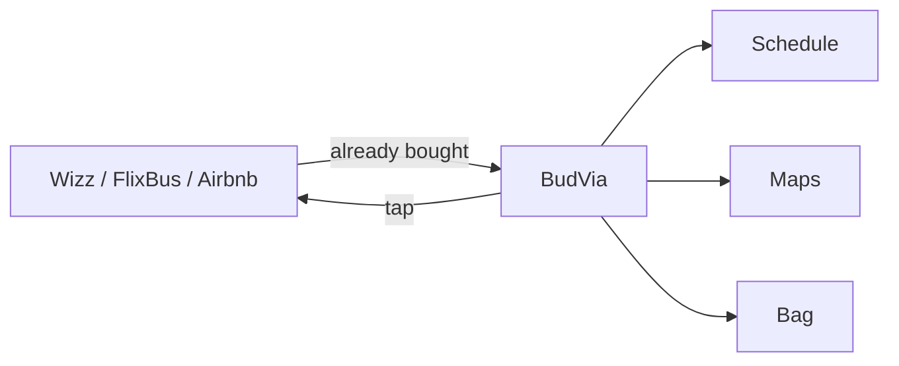

  

  
  
  
  
  

# Bir haftalık tatilini ikiye mi bölmen gerekti?

Çok mu fazla biletin var?

Hepsini organize edemiyor musun?

**Tek bir uygulamada birleştirdim. Bu kadar basit.**

Ucuz tatil böyle kuruluyor. Uçak Wizz’de. Otöbüs FlixBus’ta. Oda Airbnb’de ya da Booking’de. Şehir içi başka uygulamada. Akşam masası başka uygulamada. Her teyit ayrı kutuda. Her PNR ayrı mailde. Bir haftayı beş uygulamaya bölüyorsun. Sonra o beş parçayı tekrar bir trip haline getirmeye çalışıyorsun. Asıl yorulan yer orası. Bilet almak değil. Biletleri hatırlamak.

BudVia bilet satmıyor. Yeni bir rezervasyon sitesi de değil. Zaten aldığın şeyleri tek yerde tutuyor.

Üstüne üstlük hepsi uygulama içinden tık diye açılıyor. Bileti nereden aldıysan o uygulama açılıyor. Ayrı ayrı aramıyorsun. Tık. Gidebiliyorsunuz.

Ondan sonra trip duruyor karşında. Tüm trip. Her şey.

- Nerede başlayacak?
- Ne zaman başlıyor?
- Ne kadar erken gitmelisiniz?
- Ne zaman orada bulunmalısınız?

Tüm yolları gösteriyor. Gitmen gereken yolları gösteriyor. Saatleri gösteriyor. Çantayı gösteriyor. Sıradaki işi gösteriyor. Ve her şeyi çok basit yapıyor.

Hesap yok. Sunucu yok. Analitik yok. Plan telefonda kalıyor.

## Aç

1. [cemalsakin.github.io/belvia](https://cemalsakin.github.io/belvia/) — Safari.
2. Paylaş → **Ana Ekrana Ekle**.
3. Kendi tripini yaz ya da sample itinerary yükle.

Data `localStorage` key `belvia-v2`. Clear trip siler.

## Ne var

| Ekran | Ne işe yarar |
|---|---|
| Trip | Karşılama, uçuş kartı, sıradaki iş |
| Schedule | Tarihli hatırlatmalar, saatler |
| Places | Pin ve yol |
| Bag | Sekiz günlük örnek çanta |
| Tickets | Wizz, FlixBus, Airbnb, Booking, MOL Bubi — tık, o uygulama |

Native App Store için metin [`APP_STORE.md`](APP_STORE.md). PWA bugün Ana Ekrana eklenir.

## Publisher

Tahsin Sakin  
[linkedin.com/in/tahsinsakin](https://www.linkedin.com/in/tahsinsakin)

An idiot admires complexity, a genius admires simplicity.  
— Terry A. Davis

MIT. See `LICENSE`.

  

