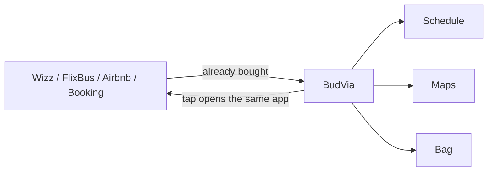

  

  
  
  
  

# Buying the ticket is easy. Keeping the trip together is not.

Cheap travel is split on purpose.

The lowest fare is on Wizz. The coach is on FlixBus. The room is on Airbnb or Booking. The city bike is another app. The dinner table is another one again. Each confirmation is cheap. Each confirmation lives in a different inbox. You spend a week assembling a trip out of five purchases, then spend the night before departure assembling those five purchases back into one trip.

BudVia is that second job.

---

## Install

Full steps: [`INSTALL.md`](INSTALL.md).

| Device | Path that works today |
|---|---|
| iPhone | Safari → [open BudVia](https://tahsinsakin.github.io/belvia/) → Share → **Add to Home Screen** |
| Android | Chrome → [open BudVia](https://tahsinsakin.github.io/belvia/) → menu → **Install app** |
| Google Play | Native bundle is prepared in `mobile/`. Listing copy is [`PLAY_STORE.md`](PLAY_STORE.md). The store page is not live until Play review accepts an AAB. |
| App Store | Listing copy is [`APP_STORE.md`](APP_STORE.md). Same rule. |

No sign-in on any of those paths. Privacy policy: [privacy.html](https://tahsinsakin.github.io/belvia/privacy.html).

---

## What it is

An on-device itinerary for trips you already booked.

It does not sell flights, coaches, or rooms. It is not a reservation site. It does not replace Wizz, FlixBus, Airbnb, or Booking. It holds the plan those apps refuse to hold together, and a tap opens the same app you used to buy the ticket.

The trip sits in one place:

- Where it starts
- When it starts
- How early you leave
- When you need to be there
- The route
- What is in the bag
- What is next

No account. No server. No analytics. The plan stays on this phone. Clear the trip and it is gone.

## What it is not

| Not this | This |
|---|---|
| A booking site | A register of bookings you already made |
| A new ticket app | A tap that opens the app you already use |
| A cloud product | Storage on this device |
| A tracking product | No login, no backend, no analytics |
| Travel advice | The itinerary you actually have |

PWA data: `localStorage` key `belvia-v2`. Native data: app storage on that phone.

## Screens

| Screen | Purpose |
|---|---|
| Trip | Arrival view, flight card, next action |
| Schedule | Dated reminders — times with dates, not times alone |
| Places | Pins and directions, opened in the system maps app |
| Bag | Packing list for the sample week |
| Tickets | Wizz, FlixBus, Airbnb, Booking, MOL Bubi |

## Publisher

Tahsin Sakin  
Information Systems Engineer · Ankara  
[linkedin.com/in/tahsinsakin](https://www.linkedin.com/in/tahsinsakin)

An idiot admires complexity, a genius admires simplicity.  
— Terry A. Davis

MIT. See `LICENSE`.
