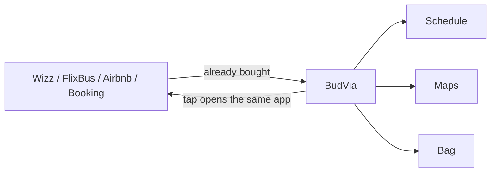

  

  
  
  
  

# Bilet almak kolay. Hatırlamak değil.

Bir haftalık tatilini ikiye mi bölmen gerekti?

Çok mu fazla biletin var?

Hepsini organize edemiyor musun?

**Tek uygulamada birleştirdim. Bu kadar.**

---

## Problem bu

Ucuz tatil kasıtlı olarak parçalı.

En ucuz uçak Wizz’de. Otobüs FlixBus’ta. Oda Airbnb’de ya da Booking’de. Şehir bisikleti başka uygulamada. Akşam masası başka uygulamada. Her teyit ayrı kutuya düşüyor. Her PNR ayrı mailde duruyor. Sen bir haftayı beş yere bölüyorsun. Sonra havalimanına çıkmadan o beş yeri tekrar tek bir trip haline getirmeye çalışıyorsun.

Kimse o ikinci işi satmıyor. Herkes birinci işi satıyor: koltuk, oda, bilet.

BudVia ikinci iş.

## BudVia ne

Zaten aldığın şeylerin durduğu yer.

Bilet satmıyor. Oda satmıyor. Yeni bir rezervasyon sitesi değil. Wizz’in rakibi değil. Wizz’i açıyor. FlixBus’u açıyor. Odayı açıyor. Tık. Gittiğin uygulama, bileti aldığın uygulama.

Üstüne trip duruyor. Tüm trip. Parça değil.

- Nerede başlayacak
- Ne zaman başlıyor
- Ne kadar erken çıkmalısın
- Ne zaman orada olmalısın
- Hangi yol
- Çantada ne var
- Sırada ne var

Saatleri gösteriyor. Yolları gösteriyor. Kapıyı gösteriyor. Çantayı gösteriyor. Ve bunu sade tutuyor. Çünkü tatilin kendisi zaten yeterince dağınık.

## Ne değil

| Bu değil | Bu |
|---|---|
| Rezervasyon sitesi | Aldığın rezervasyonun defteri |
| Yeni bir bilet uygulaması | Eski bilet uygulamalarını açan düğme |
| Hesaplı bulut | Telefondaki plan |
| Takip ürünü | Hesap yok, sunucu yok, analitik yok |
| Seyahat tavsiyesi | Sen nereye gittiysen orası |

Data `localStorage` key `belvia-v2`. Clear trip deyince biter. Başka kopya yok.

## Ekranlar

| | |
|---|---|
| **Trip** | Karşılama. Uçuş kartı. Sıradaki iş. Bugünün sırası. |
| **Schedule** | Tarihli hatırlatma. Saat. “Bir ara bir şey vardı” yok. |
| **Places** | Pin ve yol. Harita sistem uygulamasında açılır. |
| **Bag** | Sekiz günlük örnek çanta. Unuttuğun şey burada durur. |
| **Tickets** | Wizz, FlixBus, Airbnb, Booking, MOL Bubi. Tık. O uygulama. |

## Aç. Üye olma.

1. Safari → [tahsinsakin.github.io/belvia](https://tahsinsakin.github.io/belvia/)
2. Paylaş → **Ana Ekrana Ekle**
3. Örnek itinerary yükle ya da kendi tarihini yaz

Native App Store metni [`APP_STORE.md`](APP_STORE.md) içinde. PWA bugün yeter. Hesap yok.

## Kim

Tahsin Sakin  
Information Systems Engineer · Ankara  
[linkedin.com/in/tahsinsakin](https://www.linkedin.com/in/tahsinsakin)

An idiot admires complexity, a genius admires simplicity.  
— Terry A. Davis

MIT. `LICENSE`.

  

